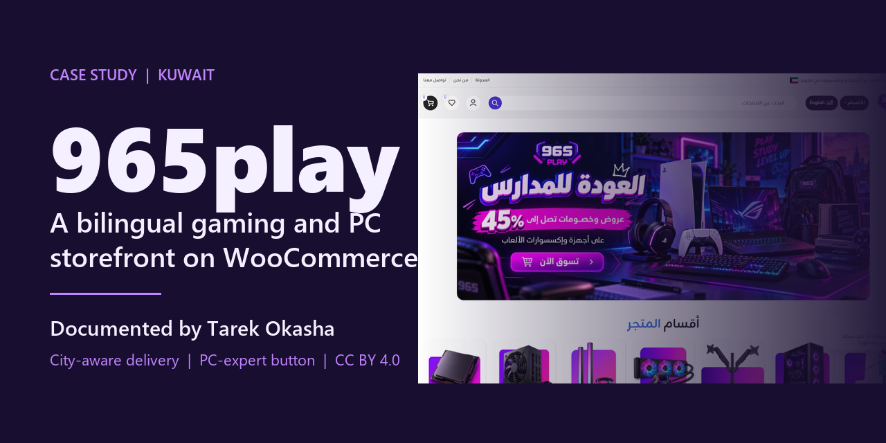
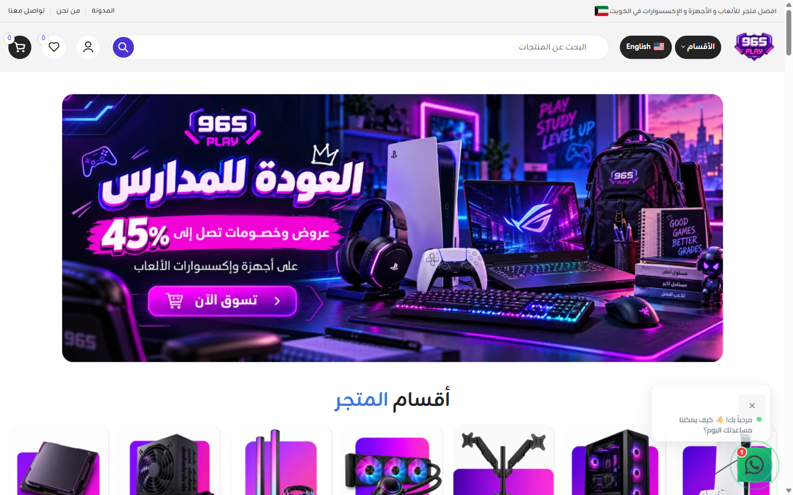
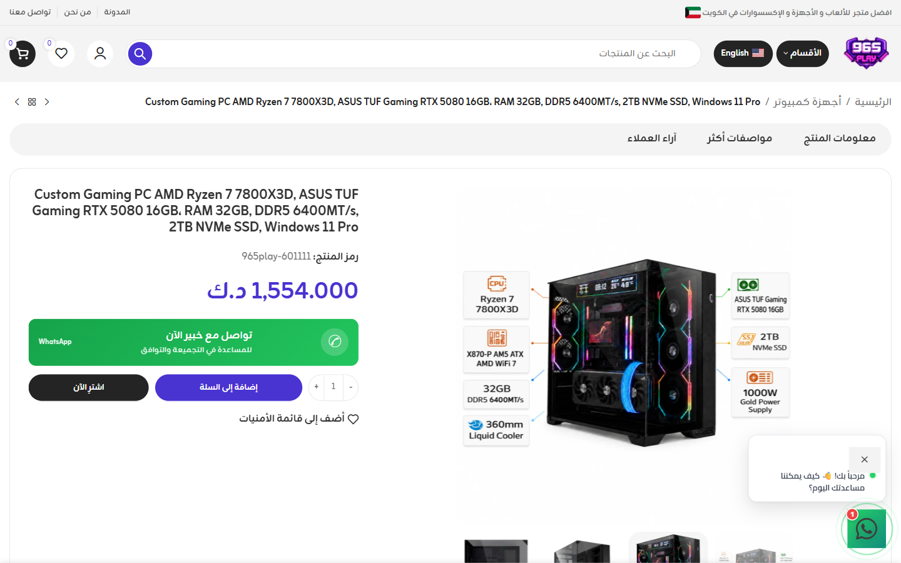
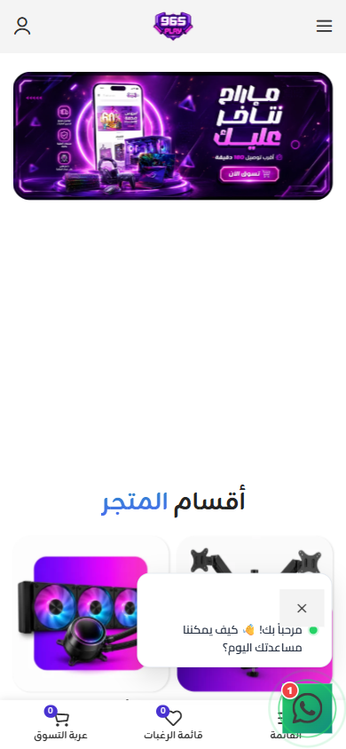

# 965play

**متجر ألعاب وأجهزة كمبيوتر ثنائي اللغة في الكويت، على ووكومرس.** 
بناه ووثّقه [طارق عكاشة](https://github.com/tarekokashha).

[**المتجر الحي**](https://965play.com) · [English](README.md) · [التوثيق](docs/) · [معرض أعمالي](https://tarek-portfolio-phi.vercel.app)

---

المتجر الحي [965play.com](https://965play.com)، التُقطت اللقطة في 2 أكتوبر 2026.

## عن المشروع

965play متجر عربي أولًا لأجهزة الألعاب وإكسسواراتها والبطاقات الرقمية والتقنية الاستهلاكية في الكويت. بنيتُ المتجر، وما زلت أعمل عليه: صفحة الدفع، وصفحات المنتجات، والتدقيق الذي يحدد ما يُحسَّن بعد ذلك. وهو أحد ثلاثة متاجر في مجموعة 965، إلى جانب [965toys](https://github.com/tarekokashha/965toys-storefront) و[965gym](https://github.com/tarekokashha/965gym-storefront).

يوثّق هذا المستودع العمل وكيف يتصرف. أما شيفرة المتجر نفسها فجزء من موقع إنتاجي ولا تُنشر هنا.

## نظرة سريعة

| | |
|---|---|
| **الدور** | بناء المتجر وهندسة صفحة الدفع والعمل على صفحات المنتجات والتدقيق وخارطة الطريق: [طارق عكاشة](https://github.com/tarekokashha) |
| **الموقع الحي** | [965play.com](https://965play.com) |
| **التقنيات** | ووردبريس وووكومرس وثيم Woodmart مع قالب فرعي وTranslatePress وElementor وGoogle Site Kit |
| **اللغات** | العربية افتراضيًا (من اليمين إلى اليسار) والإنجليزية تحت `/en/` |
| **الكتالوج** | أجهزة وإكسسوارات ألعاب، وأجهزة كمبيوتر ولابتوبات ألعاب، وستة عشر نوعًا من مكونات الكمبيوتر، ومقتنيات وبطاقات ألعاب |
| **الحساب** | تسجيل وحل كلمة المرور وتسجيل الدخول بجوجل وقائمة مفضلة |

## ما الذي بنيته

### توصيل يعرف المدينة عند الدفع
تحسب صفحة الدفع سعر التوصيل الصحيح من مدينة العميل. المدينة العادية ترى ثلاث خدمات قياسية. وأي منطقة من المناطق الست البعيدة في الكويت ترى **خدمة واحدة فقط** بسعرها النهائي، مع إخفاء المستعجل وتعطيله، ويُعاد الفحص **على الخادم** فلا يكتمل طلب بخدمة لا تطابق المدينة. اختبرتُ كل منطقة من المناطق الست، وتأكدت أن الرسوم تدخل في إجمالي طلب ووكومرس (458.700 د.ك. مع 7.000 د.ك. للخيران تعطي 465.700 د.ك.). ← [التوصيل وصفحة الدفع](docs/delivery-and-checkout.md)

### زر «تواصل مع خبير» قبل الشراء
في صفحات منتجات الكمبيوتر فقط، يفتح زر أخضر فوق «إضافة إلى السلة» محادثة واتساب باسم المنتج ورابطه في الرسالة، فيصل العميل المتردد في التوافق إلى إنسان في لحظة التردد نفسها. وتبقى أزرار الشراء الأصلية كما هي. ← [زر خبير الكمبيوتر](docs/pc-expert-button.md)

### تدقيق يقول مدى ثقته
كل نتيجة موسومة **LIVE** (مؤكدة) أو **AUDIT** (تحتاج إعادة فحص) أو **PLAN** (لم تُنفَّذ بعد)، وتمنع بوابة الإصدار تغيير الكاش أو التحديثات أو الدفع أو الشحن أو التحويلات الواسعة دون نقطة استعادة مختبرة. ← [التدقيق وخارطة الطريق](docs/audit-and-roadmap.md)

### كتالوج يتّسع
فرع عميق لمكونات الكمبيوتر وشجرة فئات واضحة، بالعربية والإنجليزية في كل مكان. ← [التقنيات والبنية](docs/stack-and-structure.md)

## لقطات

| سطح المكتب | الجوال |
|---|---|
|  |  |

## ما لا يتضمنه المستودع

تخصيصات ثيم المتجر وشيفرة الإضافات وبيانات الكتالوج والعملاء وبيانات الدخول. هي ملك نشاط تجاري قائم، لذلك يوثّق هذا المستودع العمل ولا يوزّعه. ولا تُنشر هنا أرقام هواتف المتجر أيضًا.

## الترخيص والنسبة

- **التوثيق** بترخيص [CC BY 4.0](LICENSE). تجب نسبة إعادة الاستخدام إلى **طارق عكاشة** مع رابط هذا المستودع.
- اسم 965play وشعارها وصورها، وأسماء علامات الأجهزة والألعاب في اللقطات، **غير مرخَّصة** هنا. راجع [NOTICE](NOTICE.md).

حقوق النشر (c) 2026 طارق عكاشة.

## عن المؤلف

أنا **طارق عكاشة**، مهندس روبوتات وأتمتة في القاهرة، أبني أنظمة تعمل دون إشراف: روبوتات بستة محاور، وأتمتة بالذكاء الاصطناعي، وبرمجيات مخصصة وحضورًا رقميًا للعلامات التي تعتمد عليها فعلًا. المزيد من أعمالي في [معرضي](https://tarek-portfolio-phi.vercel.app) وعلى [GitHub](https://github.com/tarekokashha).
