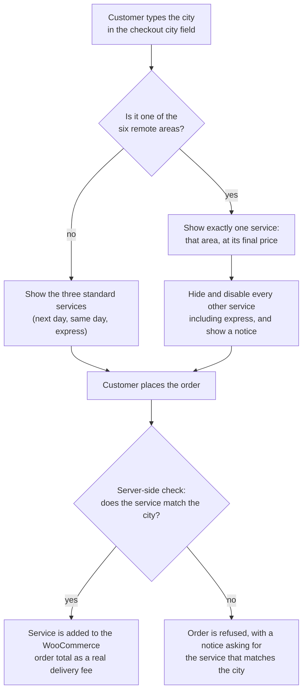

# City-aware delivery at checkout

How 965play prices delivery by area, blocks express delivery where it cannot be honoured, and refuses an order that does not match. Designed, implemented and tested by [Tarek Okasha](https://github.com/tarekokashha) on the live store on **11 August 2026**.

## The problem

Before this change the checkout offered three generic delivery services and nothing else:

- The remote areas had no separate prices anywhere in the checkout journey.
- Nothing stopped a customer in a remote area from choosing a service that could not be honoured, or paying a standard price for a distant delivery.
- Delivery prices appeared with **two** decimals in the options list, while the store shows the Kuwaiti dinar everywhere else with **three**.

The goal was a checkout that works out the right price for the customer's area, never offers what it cannot deliver, and does not rely on the browser to enforce that.

## The approved rates

Only these prices were entered. No new fees, hidden charges, minimums or separate delivery taxes were added.

| Area or service | Final price |
|---|---:|
| Next-day delivery | 1.000 KWD |
| Same-day delivery | 1.800 KWD |
| Express, 90 to 180 minutes, for orders placed before 19:00 | 2.500 KWD |
| Ali Sabah Al-Salem (Umm Al-Haiman) | 4.000 KWD |
| Al-Mutlaa | 5.000 KWD |
| Sabah Al-Ahmad Residential City | 5.000 KWD |
| Al-Wafra | 7.000 KWD |
| Al-Khiran | 7.000 KWD |
| Sabah Al-Ahmad Marine City | 7.000 KWD |

**An operating rule:** express delivery is **not available** to the remote areas.

## How it works

### The browser side

The checkout already had a city field, so it is used to decide what is allowed:

- A **normal city** such as Al-Ahmadi shows the three standard services.
- A **remote area** shows **one** service, that area's, at its final price. Every other service is hidden **and disabled** at the same moment.

The customer sees a notice that says, in effect:

> This is a remote area, and the price shown is the final delivery price to it. Express delivery is not available for this area.

Express is not merely mentioned in that notice. It is **not offered at all**, so it is not a line of text the customer can ignore.

### The server side

Hiding options in the browser is not enough, because a browser can be scripted or can misbehave. The check is repeated **in the checkout logic itself**:

- If a customer enters a remote city and selects a service that does not match it, the order does not complete. They are asked to choose the service for that area.
- If they try to select a remote-area service for an ordinary city, the system refuses that as well.

So the correct price does not depend on the front end behaving, and the chance of an order being priced wrongly at completion is reduced.

### The fee is a real fee

It was checked in practice that the selected service is added to the WooCommerce order total as an actual delivery fee, and is not just text shown to the customer:

| Basket | Service | Order total |
|---|---|---:|
| 458.700 KWD product | Same-day, 1.800 KWD | **460.500 KWD** |
| 458.700 KWD product | Al-Khiran, 7.000 KWD | **465.700 KWD** |

## Tested

Each of the six remote areas was entered in the city field, and in every case **exactly one** option became available:

| City entered at checkout | The only service enabled | Price |
|---|---|---:|
| Ali Sabah Al-Salem (Umm Al-Haiman) | The Umm Al-Haiman service | 4.000 KWD |
| Al-Mutlaa | The Al-Mutlaa service | 5.000 KWD |
| Sabah Al-Ahmad Residential City | The residential city service | 5.000 KWD |
| Al-Wafra | The Al-Wafra service | 7.000 KWD |
| Al-Khiran | The Al-Khiran service | 7.000 KWD |
| Sabah Al-Ahmad Marine City | The marine city service | 7.000 KWD |

In each test, next-day, same-day and express were hidden and disabled, along with the other, non-matching remote-area services.

## Prices shown correctly

Delivery prices now show with three decimals in the options list (`1.000 KWD`, `7.000 KWD`), matching how the dinar is shown on product pages and in the total.

## What was changed, and what was not

**Changed**

1. The store's existing delivery-services plugin: the service names and prices, the three-decimal display, and the server-side check that the city matches the area service.
2. Custom code in the theme's own settings: the JavaScript that shows, hides and disables services by city, the JavaScript for the pre-sales button ([pc-expert-button.md](pc-expert-button.md)), and the CSS for the button and the delivery notice.

**Not changed**

- The payment gateway settings.
- Product prices.
- The WhatsApp notification plugin and its API settings.
- Theme, WooCommerce or Elementor versions. No updates were applied.
- No areas or prices beyond the approved list were added.

## Why this matters operationally

- The customer sees a price that fits their location, in place of a long and confusing list.
- A remote-area customer does not expect an express service that cannot be provided, and the express condition (orders before 19:00) is visible before they pay.
- A remote order cannot be recorded with a standard delivery price by mistake, and the service name saved with the order tells support exactly why the delivery cost what it did.
- Sales staff never have to change a shipping price by hand: when the city is remote, the approved price appears automatically.

## What was recommended next

These were deliberately **not** done in this task, because each needs an operating decision or more data:

- Turn the city field into a structured list of areas, if a complete approved list for all of Kuwait is supplied, to remove spelling errors.
- Tie the "before 19:00" condition to the server's time, so express disappears after the cut-off instead of relying on text alone. (I later solved this for a sibling store, including the shipping-cache subtlety that makes it hard to get right: see [965toys, delivery rules](https://github.com/tarekokashha/965toys-storefront/blob/main/docs/delivery.md).)
- Add a confirmation message on the order-received page stating the chosen service and expected delivery time.
- Measure clicks on the PC-expert button, and the sales that come from WhatsApp, with a GA4 event.
- Agree a response-time target for the WhatsApp team, because the value of the button depends on how quickly the expert replies.
