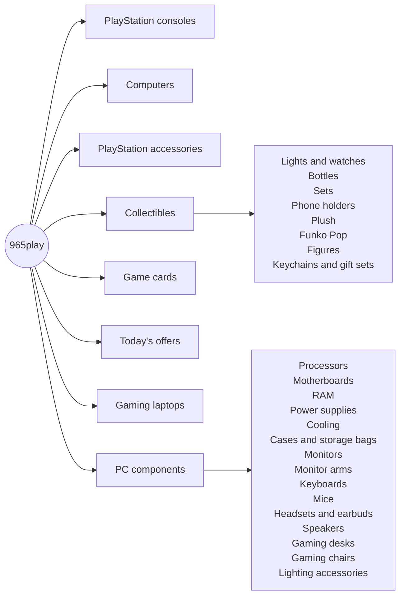

# Stack and catalogue structure

What 965play is built on, and how its catalogue is organised. Everything here was read from the live store on **2 October 2026**. Built by [Tarek Okasha](https://github.com/tarekokashha).

## Stack

| Layer | What |
|---|---|
| CMS and commerce | WordPress and WooCommerce |
| Theme | **Woodmart** as the parent, with a **child theme** that carries the customisation |
| Languages | Arabic by default, right to left, with English under `/en/`, through **TranslatePress** |
| Page building | Elementor, for the pages that use it |
| Analytics | Google Site Kit |
| Delivery | A delivery-services plugin that supplies the checkout services (see [delivery-and-checkout.md](delivery-and-checkout.md)) |
| Hosting | A LiteSpeed server |

Account features: registration, lost-password recovery and **Google sign-in**, a wishlist, a cart, a blog, and the about and contact pages. A floating WhatsApp chat button is available on the pages.

## What the store sells

Gaming hardware, accessories, digital cards and consumer technology in one storefront: consoles and their accessories, PCs and gaming laptops, a deep range of PC components, collectibles, and game cards, with a "today's offers" category for promotions.

## Catalogue structure

Two categories do the heaviest lifting for this document:

- **Computers** is where the [pre-sales PC-expert button](pc-expert-button.md) appears, because that is where a customer most needs help before buying.
- **PC components** is the deepest branch, with sixteen sub-categories, which is why the header carries a categories menu and a search field.

## The shared system

965play is one of three stores in the 965 collection, alongside [965toys](https://github.com/tarekokashha/965toys-storefront) and [965gym](https://github.com/tarekokashha/965gym-storefront). Each has its own identity and catalogue, and they share an approach: an Arabic-first, right-to-left storefront on WooCommerce and Woodmart, with delivery and messaging designed around how people in Kuwait actually shop, which includes WhatsApp as a first-class channel.

## Where the work is documented

| Topic | Document |
|---|---|
| City-aware delivery at checkout | [delivery-and-checkout.md](delivery-and-checkout.md) |
| The pre-sales PC-expert button | [pc-expert-button.md](pc-expert-button.md) |
| The audit and roadmap | [audit-and-roadmap.md](audit-and-roadmap.md) |
